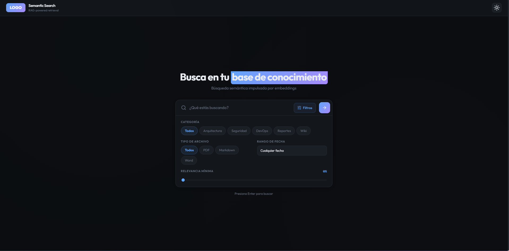
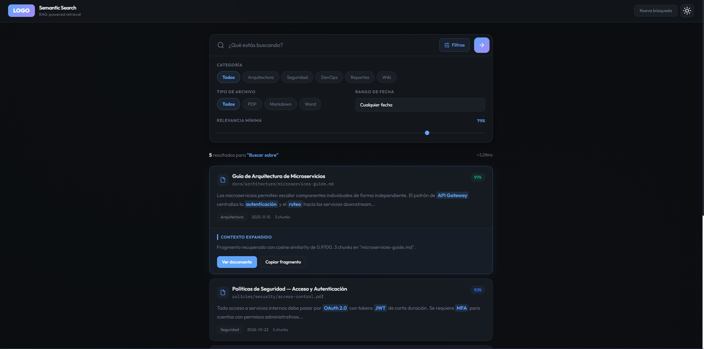

# ai-frontend-templates

Colección de plantillas frontend listas para conectar con backends de IA. Cada plantilla incluye mocks de datos, sistema de colores personalizable y puntos de conexión claramente marcados.

---

## Plantillas disponibles

### 1. `rag/` — Chat RAG + Agente SQL

Chat conversacional con historial y un agente de consultas SQL en lenguaje natural.


**Stack:** React 18 · TypeScript · Vite · Tailwind CSS · Shadcn/Radix UI

| Característica | Detalle |
|---|---|
| Chat RAG | Conversaciones con historial, archivos adjuntos, votos |
| Agente SQL | Lenguaje natural → SQL, tablas y gráficas de resultados |
| Mocks | `VITE_USE_MOCKS=true` activa datos de prueba sin backend |
| Colores | Variables `--brand-primary/secondary/accent` en `index.css` |
| Auth | Stub listo para conectar (MSAL, Auth0, JWT, Keycloak) |

```bash
cd rag && npm install && npm run dev
```

→ Ver [rag/README.md](rag/README.md)

---

### 2. `search-engine/` — Búsqueda Semántica

| | |
|---|---|
|  |  |

Interfaz de búsqueda sobre bases de conocimiento con filtros por categoría, tipo de archivo, fecha y relevancia mínima.

**Stack:** React 19 · TypeScript · Vite · Tailwind CSS v4

| Característica | Detalle |
|---|---|
| Búsqueda semántica | Consultas en lenguaje natural con score de similitud coseno |
| Filtros | Categoría, tipo de archivo, rango de fechas, relevancia mínima |
| Badges | Exacto ≥95% / Alto ≥85% / Medio ≥70% / Bajo <70% |
| Contexto expandido | Fragmento ampliado por resultado |
| Tema | Claro / oscuro con variables CSS |

```bash
cd search-engine && npm install && npm run dev
```

→ Ver [search-engine/README.md](search-engine/README.md)

---

### 3. `chat_bot/` — Chatbot de Planificación


Chatbot dark-mode con sugerencias rápidas y diseño minimalista.

**Stack:** Next.js 15 · React 19 · TypeScript · Tailwind CSS v4 · Shadcn/Radix UI

| Característica | Detalle |
|---|---|
| Diseño | Dark mode por defecto, toggle claro/oscuro |
| Sugerencias | Pills de acciones rápidas configurables |
| Mocks | Respuestas simuladas en `app/page.tsx` → `getAIResponse()` |
| Backend | Conectar en `handleSubmit()` con `NEXT_PUBLIC_API_URL` |

```bash
cd chat_bot && npm install && npm run dev
```

→ Ver [chat_bot/README.md](chat_bot/README.md)

---

## Comparativa rápida

| | `rag` | `search-engine` | `chat_bot` |
|---|---|---|---|
| Framework | React + Vite | React + Vite | Next.js 15 |
| Tailwind | v3 | v4 | v4 |
| Mocks incluidos | ✅ con env var | ✅ en `src/mock/` | ✅ en `page.tsx` |
| Auth stub | ✅ | — | — |
| Docker | ✅ | — | ✅ |

---

## Flujo para usar una plantilla

```
1. Copiar la carpeta de la plantilla a tu proyecto
2. cp .env.example .env
3. npm install
4. npm run dev          ← funciona con mocks
5. Cambiar colores en index.css / globals.css
6. Conectar backend:    VITE_USE_MOCKS=false (o NEXT_PUBLIC_API_URL=...)
7. Conectar auth:       editar src/utils/auth.ts (o app/page.tsx)
```
