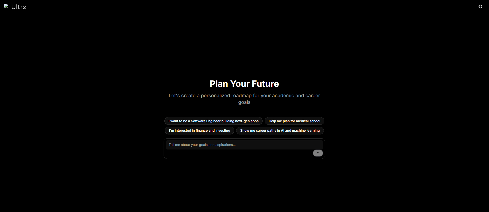
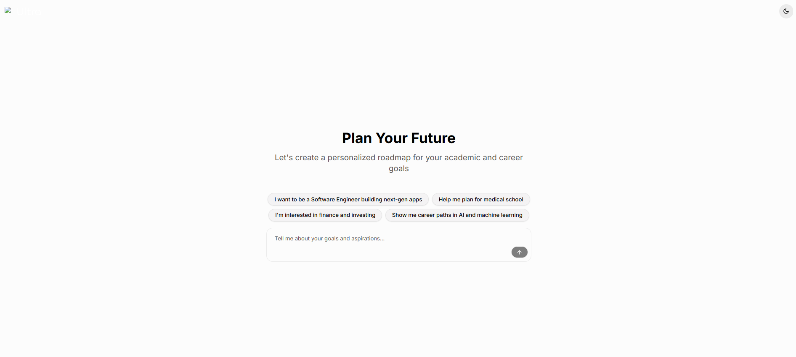

# Ultra – Frontend (Chatbot de planificación)

Frontend de **Ultra**, una aplicación de planificación de metas académicas y profesionales con interfaz tipo chatbot. Desarrollado con **Next.js 15**, **React 19** y **Tailwind CSS**.

---

## Requisitos

- **Node.js** 20 o superior
- **npm** (o yarn / pnpm)

---

## Estructura del proyecto

```
template_chatbot_dark/
├── app/                    # App Router de Next.js
│   ├── layout.tsx          # Layout raíz (fuentes, ThemeProvider, metadata)
│   ├── page.tsx            # Página principal: chat, sugerencias, estado
│   └── globals.css         # Estilos globales (Tailwind + variables light/dark)
├── components/
│   ├── ui/                 # Componentes de interfaz (shadcn/ui, Radix, etc.)
│   │   ├── button.tsx
│   │   ├── chat-input.tsx
│   │   └── ...
│   ├── chat-message.tsx    # Mensaje del chat (usuario / asistente)
│   ├── suggestion-pills.tsx # Píldoras de sugerencias
│   └── theme-provider.tsx  # Proveedor de tema (next-themes)
├── hooks/
│   ├── use-toast.ts
│   ├── use-textarea-resize.ts
│   └── use-mobile.ts
├── lib/
│   └── utils.ts            # Utilidades (cn, etc.)
├── styles/
│   └── globals.css         # Referencias de estilos
├── public/                 # Assets estáticos (favicon, iconos, imágenes)
├── next.config.mjs         # Config Next (standalone, imágenes, TypeScript)
├── package.json
├── Dockerfile              # Imagen para ejecutar el front en producción
└── .dockerignore
```

### Descripción breve por carpeta

| Ruta                    | Uso                                                                                          |
| ----------------------- | -------------------------------------------------------------------------------------------- |
| `app/`                | Rutas y páginas.`page.tsx` contiene la lógica del chat, envío de mensajes y respuestas. |
| `components/ui/`      | Componentes reutilizables (botones, inputs, chat-input, etc.).                               |
| `components/` (raíz) | Componentes de dominio: mensajes del chat, sugerencias, tema.                                |
| `hooks/`              | Hooks de React (toast, resize de textarea, detección móvil).                               |
| `lib/`                | Utilidades compartidas.                                                                      |
| `public/`             | Recursos estáticos servidos en `/`.                                                       |

---

## Construcción del frontend

El proyecto usa **Next.js** con App Router y compilación estándar.

### Comandos principales

| Comando           | Descripción                                                                  |
| ----------------- | ----------------------------------------------------------------------------- |
| `npm install`   | Instala dependencias.                                                         |
| `npm run dev`   | Modo desarrollo con hot reload en[http://localhost:3000](http://localhost:3000). |
| `npm run build` | Genera la build de producción (incluye salida `standalone` para Docker).   |
| `npm run start` | Sirve la build de producción (ejecutar tras `npm run build`).              |
| `npm run lint`  | Ejecuta ESLint.                                                               |

### Tecnologías clave

- **Next.js 15** – Framework React (SSR, enrutado, API routes si se usan).
- **React 19** – Interfaz y estado del chat.
- **Tailwind CSS 4** – Estilos y temas (variables en `app/globals.css`).
- **next-themes** – Tema claro/oscuro (selector en la esquina superior derecha).
- **Radix UI / shadcn** – Componentes accesibles en `components/ui/`.
- **TypeScript** – Tipado (configuración en `tsconfig.json` y `next.config.mjs`).

La build de producción se genera con `next build` y, por configuración (`output: 'standalone'`), deja listo el artefacto para empaquetar en Docker.

---

## Cómo se ejecuta

### En local (desarrollo)

```bash
npm install
npm run dev
```

Abre [http://localhost:3000](http://localhost:3000).

### En local (producción)

```bash
npm install
npm run build
npm run start
```

La app se sirve en el puerto **3000**.

### Con Docker

```bash
# Construir la imagen
docker build -t ultra-front .

# Ejecutar el contenedor
docker run -p 3000:3000 ultra-front
```

La aplicación queda disponible en **http://localhost:3000**. La imagen usa Node 20 Alpine y el output `standalone` de Next.js para reducir tamaño.





---

## Conexión con el backend

En el estado actual del código **no hay llamadas a un backend externo**. Las respuestas del chat se generan en el propio frontend mediante la función **`getAIResponse()`** en `app/page.tsx`, que devuelve respuestas simuladas según palabras clave del mensaje del usuario.

### Dónde se “conectaría” el backend

La lógica de envío está en **`handleSubmit()`** en `app/page.tsx`. Ahí es donde se debería:

1. Enviar el mensaje del usuario al backend (por ejemplo con `fetch` o un cliente HTTP).
2. Recibir la respuesta del asistente.
3. Añadir esa respuesta al estado `messages` y dejar de usar `getAIResponse()` para esa petición.

### Cómo conectar un backend real

1. **Variable de entorno**Definir la URL base del API, por ejemplo en `.env.local`:

   ```env
   NEXT_PUBLIC_API_URL=http://localhost:8000
   ```

   (Ajusta el puerto y la ruta según tu backend.)
2. **Uso en el front**En `handleSubmit()` (en `app/page.tsx`), sustituir la simulación por algo similar a:

   ```ts
   const res = await fetch(`${process.env.NEXT_PUBLIC_API_URL}/api/chat`, {
     method: 'POST',
     headers: { 'Content-Type': 'application/json' },
     body: JSON.stringify({ message: inputValue }),
   });
   const data = await res.json();
   // Añadir data.reply (o el campo que devuelva tu API) a messages
   ```
3. **CORS**
   El backend debe permitir peticiones desde el origen del front (por ejemplo `http://localhost:3000` en desarrollo).

Resumen: la “conexión” con el backend se hace en **`app/page.tsx`**, en **`handleSubmit()`**, usando una variable de entorno para la URL y sustituyendo la lógica actual de `getAIResponse()` por una llamada `fetch` (u otro cliente) a tu API.

---

## Variables de entorno (opcional)

Si añades backend u otros servicios, puedes usar:

| Variable                | Uso                                                          |
| ----------------------- | ------------------------------------------------------------ |
| `NEXT_PUBLIC_API_URL` | URL base del API del backend (ej.`http://localhost:8000`). |

Crear `.env.local` en la raíz del proyecto (no se sube a Git; ya está en `.gitignore`).

---

## Resumen

- **Construcción:** `npm run build` (Next.js con salida `standalone`).
- **Ejecución:** `npm run dev` (desarrollo) o `npm run start` (producción), o con Docker como se indica arriba.
- **Estructura:** App Router en `app/`, componentes en `components/`, estilos en `app/globals.css` y `styles/`.
- **Backend:** Hoy no hay conexión; se integra en `app/page.tsx` → `handleSubmit()` usando `NEXT_PUBLIC_API_URL` y `fetch` (o similar).
