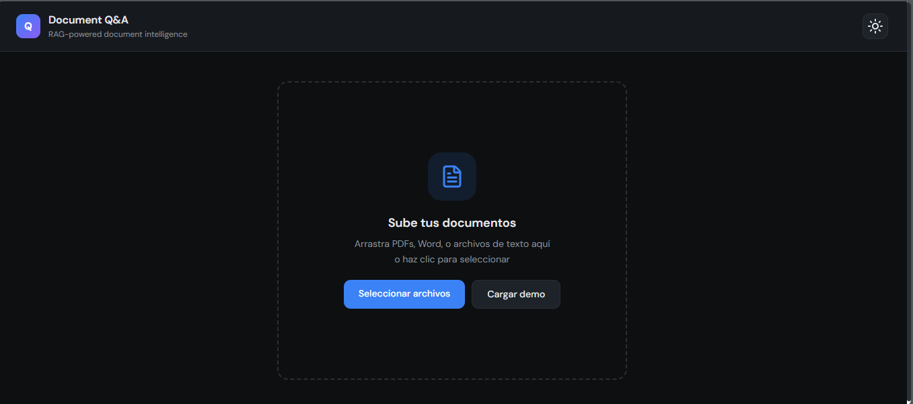
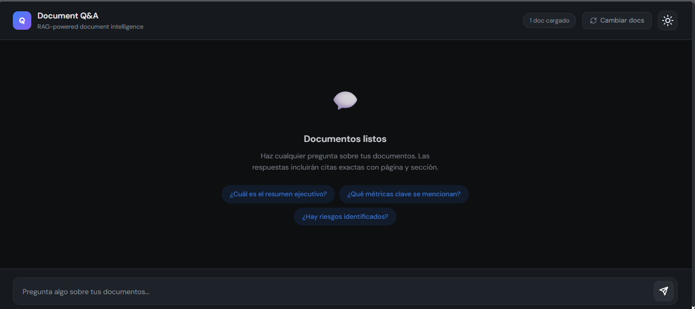

# Document Q&A — Plantilla Frontend

Interfaz de preguntas y respuestas sobre documentos. El usuario sube PDFs o archivos Word y hace preguntas en lenguaje natural; las respuestas incluyen citas exactas con página, sección y score de relevancia.

Stack: React 19 + TypeScript + Vite + Tailwind CSS v4.

---

## Vista previa

### Carga de documentos


### Chat con citas


---

## Inicio rápido

```bash
npm install
npm run dev
```

---

## Conectar backend

### Endpoint esperado

```
POST /api/qa
Content-Type: application/json
```

**Request:**
```json
{
  "query": "¿Cuál es el margen operativo del Q3?",
  "documents": [
    { "id": 1, "name": "Informe_Q3.pdf" }
  ]
}
```

**Response:**
```json
{
  "answer": "El margen operativo se situó en 18.5%...",
  "sources": [
    {
      "doc": "Informe_Q3.pdf",
      "page": 28,
      "section": "Análisis de Márgenes",
      "relevance": 0.88,
      "text": "El margen operativo se situó en 18.5%..."
    }
  ]
}
```

Configura la URL del backend en `.env`:

```
VITE_API_URL=http://localhost:8000
```

El bloque de conexión está en `src/DocumentQA.tsx` — busca el comentario `// ── Replace this block ──`.

---

## Estructura del proyecto

```
src/
├── components/
│   ├── Header.tsx        # Header sticky con badge de docs y botón cambiar
│   ├── UploadZone.tsx    # Zona de drag & drop para subir documentos
│   ├── EmptyChat.tsx     # Estado vacío con preguntas sugeridas
│   ├── MessageList.tsx   # Burbujas de chat con botones de fuente
│   ├── SourcePanel.tsx   # Panel lateral con fragmento extraído
│   ├── InputBar.tsx      # Barra de entrada con textarea y envío
│   └── FileIcon.tsx      # Ícono de archivo (PDF / Word)
├── interface/
│   ├── Theme.ts          # Interface ThemeTokens (dark/light)
│   ├── Document.ts       # Interface Document
│   ├── Source.ts         # Interface Source (cita con relevancia)
│   └── Message.ts        # Interface Message (user | assistant)
├── mock/
│   └── data.ts           # Documentos y respuestas de ejemplo
├── utils/
│   └── relevance.ts      # relevanceColor() — verde/azul/amarillo por score
├── DocumentQA.tsx        # Componente principal — orquesta todo
└── App.tsx
```

---

## Funcionalidades

| Feature | Descripción |
|---|---|
| Drag & drop | Subir PDFs, Word y archivos de texto |
| Demo instantánea | Botón "Cargar demo" sin necesidad de backend |
| Cambiar documentos | Botón en header para volver al estado inicial |
| Citas inline | Cada respuesta muestra sus fuentes con doc, página y sección |
| Score de relevancia | Badge con código de colores (verde ≥90%, azul ≥80%, amarillo <80%) |
| Panel de fuente | Clic en una cita abre el fragmento extraído con barra de relevancia |
| Preguntas sugeridas | Chips de ejemplo cuando los documentos están listos |
| Tema claro/oscuro | Toggle en el header |

---

## TypeScript interfaces

```ts
// src/interface/Source.ts
interface Source {
  doc: string;
  page: number;
  section: string;
  relevance: number;  // 0–1 (cosine similarity)
  text: string;       // fragmento extraído
}

// src/interface/Message.ts
interface Message {
  role: 'user' | 'assistant';
  text: string;
  sources?: Source[];
}
```

---

## Scripts

```bash
npm run dev       # Servidor de desarrollo
npm run build     # Build de producción
npm run preview   # Preview del build
npm run lint      # ESLint
```
